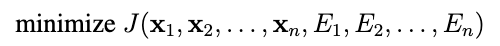
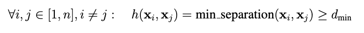
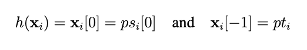
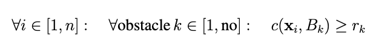
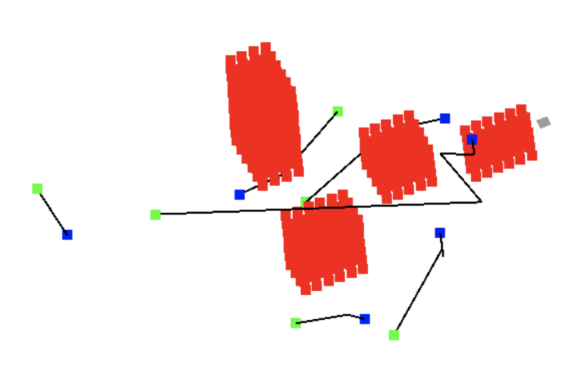
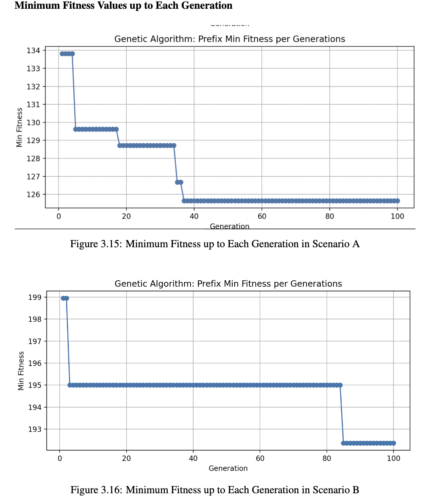
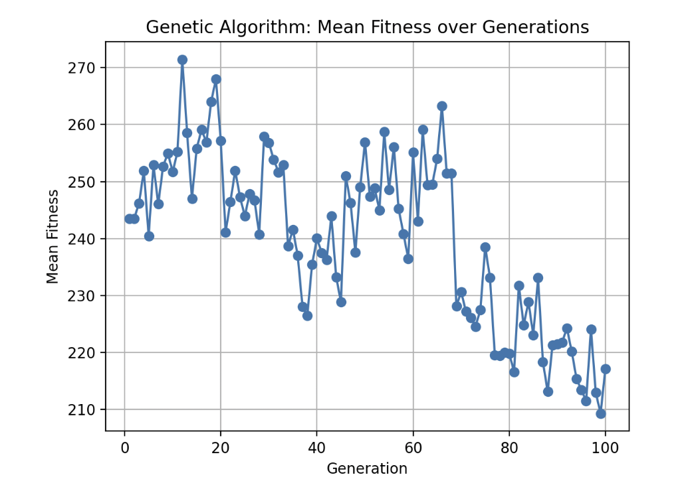

# Path Planning for UAVs Using Meta-Heuristics

## Overview

This repository contains an implementation of a path-planning solution for Unmanned Aerial Vehicles (UAVs) operating in continuous 3D spaces. The project is inspired by and implements the findings from the paper titled [Optimized Path-Planning in Continuous Spaces for Unmanned Aerial Vehicles Using Meta-Heuristics](https://ieeexplore.ieee.org/document/9206009). The problem is addressed using various meta-heuristic algorithms, including Particle Swarm Optimization, Genetic Algorithm, Bat Algorithm, and Simulated Annealing. The primary objective is to find optimal paths for a fleet of drones to navigate from their starting points to target points in a 3D workspace while avoiding collisions with each other and obstacles, with an emphasis on minimizing total travel time and energy consumption.

## Problem Formulation

### 2.1 Problem Statement

The problem involves determining optimal paths for \(n\) drones to travel from their respective starting points (\(\psi\)) to target points (\(\pti\)) in a 3D workspace. The objective is to minimize the total time taken for all drones to reach their targets, considering their constant speed. Additionally, the solution aims to minimize the total energy consumed by the drones, adhering to a constraint on the maximum allowable energy.

### 2.2 Decision Variables

For each drone \(i\), the decision variables include a vector \(x_i\) representing the 3D control points along the drone's path and the energy consumption variable \(E_i\).

### 2.3 Objective Function

The objective function \(J\) is defined as the sum of individual travel times and energy consumption for all drones, with a weighting factor \(\alpha\) to balance time and energy considerations.

Where \(J\) is calculated as the sum of individual travel times and energy consumption for each drone \(i\):

### 2.4 Constraints

#### 2.4.1 Minimum Separation between Drones

Ensure a minimum separation distance between the paths of all drones to prevent collisions.

#### 2.4.2 Start and Target Points

Define equality constraints for each drone to ensure they start from their respective starting points and reach their target points.

### 2.5 Inequality Constraints

#### 2.5.1 Avoiding Obstacle Collisions

Ensure that the paths of the drones do not intersect with obstacles in the workspace.

Where \(c(x_i, B_k)\) is a function that determines if the path of drone \(i\) intersects with the 3D obstacle \(B_k\), and \(r_k\) is a minimum separation distance between the path of drone \(i\) and the obstacle \(B_k\).

### 2.6 Assumptions

- The drones maintain a constant speed.
- The paths are continuous, and the control points form a continuous trajectory.

## Algorithms Used

The solution employs various meta-heuristic algorithms, including:
- Particle Swarm Optimization
- Genetic Algorithm
- Bat Algorithm
- Simulated Annealing

## Results

Feel free to explore and contribute to further enhancements of the algorithms or the problem formulation. Feedback and contributions are highly appreciated!
